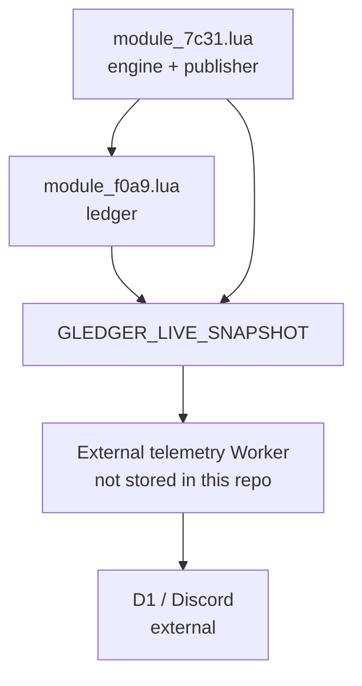

# Project state

Last audited: 2026-08-12

## Scope and current baseline

`main` is a small Lua runtime repository with three tracked files:

- `module_7c31.lua` — the Mini Pinata runtime engine and telemetry publisher.
- `module_f0a9.lua` — a separately supervised client-side ledger loaded by the
  engine.
- `README.md` — minimal repository description.

The repo does not contain the account router, Cloudflare Worker source,
database migrations, deployment configuration, or runtime credentials. Those
components therefore cannot be reproduced from this repository alone.

## What it currently does

For clients with `GPINATA_ENABLED` enabled, `module_7c31.lua`:

- starts the independent ledger bootstrap;
- maintains the Mini Pinata runtime state, status reporting, retry/restart
  handling, and optional Discord webhook delivery;
- publishes live telemetry asynchronously when runtime telemetry settings are
  provided.

The ledger (`module_f0a9.lua`) observes save/inventory data, accumulates
positive diamond gains, configured item gains, and Mini Pinata consumption,
and exposes `GLEDGER_LIVE_SNAPSHOT` for the engine publisher. It also produces
35-minute local reports and persists a daily profile when file APIs exist.

## Architecture

The engine downloads the ledger from `main` and starts it in a separate task.
The ledger is therefore designed not to block the engine when its download,
compile, or runtime startup fails.

## Known-good behavior

Observed and recorded before this audit:

- The three active Mini Pinata accounts published real live telemetry through
  the engine → Worker → D1 → Discord path.
- Recorded live rates were approximately 9.2–9.5 confirmed placements/minute
  at healthy accounts, with 100% confirmation shown in the reported snapshots.
- The direct-gem ledger subsequently reached the `/profit` display.
- The day boundary was changed on `main` by merged PR #5: daily ledger values
  use the client computer's local calendar day. On the farm Macs this is
  intended to mean midnight Pacific.

These are historical validations, not a guarantee that the presently running
clients have reloaded the latest `main` code.

## Important settings and timing values on `main`

| Area | Current value / behavior |
|---|---|
| Base engine interval | `GPINATA_INTERVAL`, default `6.2` seconds |
| Adaptive range | runtime router snapshot sets `6.2`–`8.0` seconds; this router is external to the repo |
| Telemetry cadence | runtime publisher is configured to constrain its interval to 20–30 seconds; previous live setup used 25 seconds |
| Ledger sample cadence | `GLEDGER_SAMPLE_SECONDS`, default 15 seconds, minimum 5 seconds |
| Ledger report cadence | `GLEDGER_REPORT_SECONDS`, minimum 300 seconds; the existing setup used 35 minutes |
| Ledger checkpoints | periodic, 300 seconds in the pre-PR #6 baseline |
| Ledger daily boundary | local client calendar day (merged PR #5) |
| Cost basis used by external profit display | 50,000 gems per consumed Mini Pinata, based on prior project decision |
| RAP treatment in external Worker | public PS99RAP catalogue with a 90% realization factor, based on the saved Worker snapshot; Worker source is not version-controlled here |

## Known bugs and failure modes

### Current `main`

- The ledger tracks `Cocktail`, while the available router snapshot uses
  `The Cocktail`. Its exact normalized-match scan can omit Cocktail gains.
- Daily cumulative inventory counts can move backward after a relaunch because
  periodic persistence may lag live telemetry.
- Profiles are named with both account user ID and `game.PlaceId`; changing
  place creates a separate persisted daily profile.
- The client telemetry payload on `main` has no ledger-session ownership
  fields. If an older and replacement client write for the same account, the
  external backend cannot reliably reject an older session from this repo's
  payload alone.
- The ledger detects positive inventory deltas between samples, not game drop
  events. A qualifying item gained and removed between samples can be missed.
- Ledger persistence is optional. Without usable file APIs, totals are session
  only.
- Profit accounting is not a complete fleet accounting system: it cannot
  reconstruct transfers, sales, openings, or activity before the tracked
  baseline.

### Runtime/operational risks

- The runtime router is outside this repository and is the source of account
  assignment and environment settings. Its loaded version must be verified
  during any incident.
- The Worker/D1/Discord path is outside the repository. Changes there can
  change displayed value or continuity independently of these Lua files.
- The engine/ledger rely on runtime HTTP, loading, and file APIs. Missing or
  failing APIs disable or degrade those features.

## Experiments and changes already tried

| Date | Change / experiment | Outcome |
|---|---|---|
| 2026-08-11 | Telemetry publisher (PR #1) | Merged; live three-account reporting was recorded. |
| 2026-08-11 | Direct-gem ledger publishing (PR #2) | Merged; `/profit` received direct gem movement. |
| 2026-08-11 | 50k-per-Pinata cost integration (PR #3) | Merged. |
| 2026-08-11 | RAP-valued qualifying-loot telemetry (PR #4) | Merged; valuation occurs in the external Worker. |
| 2026-08-11 | Local-midnight daily boundary (PR #5) | Merged; requires client restart to load. |
| 2026-08-12 | Ledger continuity repair (PR #6) | Draft/open, not part of `main` and not yet live. |

## Pending PR #6: not deployed

Draft PR #6 (`agent/fix-profit-ledger-continuity`) proposes these fixes:

- canonicalize `Cocktail` and `The Cocktail` to `The Cocktail`;
- change the default ledger sampling interval to 2 seconds (minimum 1 second);
- save immediately after tracked gain/consumption changes;
- migrate to one account-wide profile with fallback loading of the legacy
  place-specific profile;
- publish ledger day/session metadata for external session ownership handling.

The accompanying Worker changes are outside this repository. Treat all of the
above as proposed until PR #6 is merged and the Worker/client rollout is
validated.

## Unresolved questions

1. Is the external Worker running the session-rejection and monotonic-total
   changes intended for PR #6?
2. What exact router revision and runtime settings are installed on each
   active account?
3. Does the current inventory data identify all intended loot reliably, beyond
   the known Cocktail alias issue?
4. Are live placement stalls correlated with another runtime activity, network
   conditions, or the adaptive controller? Existing repo evidence does not
   establish causation.
5. Which reported profit figure should be authoritative for operations given
   transfers and actions outside the observed inventory/balance deltas?

## Immediate next priorities

1. Review and, if approved, merge PR #6; deploy its matching external Worker
   changes before restarting clients.
2. Verify a fresh telemetry snapshot from each account after rollout, including
   Cocktails, Charm Stones, session ID, and nondecreasing daily loot totals.
3. Run controlled observations with one changed condition at a time and log
   every run in `docs/TEST_LOG.md`.
4. Bring the router and Worker source/configuration under version control or
   document their exact deployment locations and versions.
